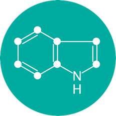
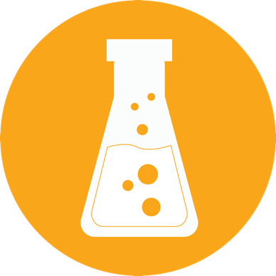

# HMS LINCS Small Molecule Library applications

  

<a href = "https://shiny.ilincs.org/query_gene_app/" style = "color:#EC4353;">
  
Search by gene target</a>

<a href = "https://shiny.ilincs.org/query_drug_app/" style = "color: #00AC9F;">
  
Search by compound</a>

<a href = "https://shiny.ilincs.org/custom_library_app/" style = "color: orange">
  
Create a custom chemical genetics library for a set of genes</a>

<b><a href = "https://shiny.ilincs.org/query_gene_app/" style = "color:#EC4353;">The gene query app</a></b> lets you see all compounds in the <a href = "http://hits.harvard.edu/the-program/laboratory-of-systems-pharmacology/about/">HMS Laboratory of Systems Pharmacology (LSP)</a> collection that have been shown to bind your target of interest. To find compounds, first select your target of interest and binding criteria. Subsequently, you select a region in the main plot with compounds of your interest. You can then select three compounds and view their known binding affinities in detail.

<b><a href = "https://shiny.ilincs.org/query_drug_app/" style = "color: #00AC9F;">The drug query app</a></b> is designed to let you explore compounds that are similar to your compound of interest. Similarity is regarded in threefold: structural similarity, target affinity spectrum similarity (TAS) and phenotypic fingerprint similarity (PFP). To view compounds that are similar, you first select a reference compound of your choice, you then set some thresholds for the distance metrics and finally select up to three similar compounds that you like to explore further. We show the known targets and affinities for the selected compounds, for your information.

<b><a href = "https://shiny.ilincs.org/custom_library_app/" style = "color: orange">The custom drug library app</a></b> composes a custom chemical genetics library for a set of genes. The compounds of genes are selected based on affinity, selectivity and clinical development phase. Additionally we source several expert opinion "best-in-class" list. For this tool to work, please submit a list of genes symbols of your interest in the text box (or load our example gene list) and click 'Submit'.
After submitting your gene list, a downloadable table of drugs targeting those genes will be generated. You may further adjust the library by selectivity level and clinical development phase. You will also have the opportunity to add compounds from the expert opinion "best-in-class" compounds.

# Development and links

Design/idea by [Nienke Moret](https://github.com/nmoret/) and [Marc Hafner](https://scholar.harvard.edu/hafner) (HMS)

R code by [Nienke Moret](https://github.com/nmoret/) (HMS)

Shiny/R web application development by [Nicholas Clark](https://github.com/NicholasClark) (U of Cincinnati)

Supervision by [Peter Sorger](https://sorger.med.harvard.edu/people/peter-sorger-phd/) (HMS)